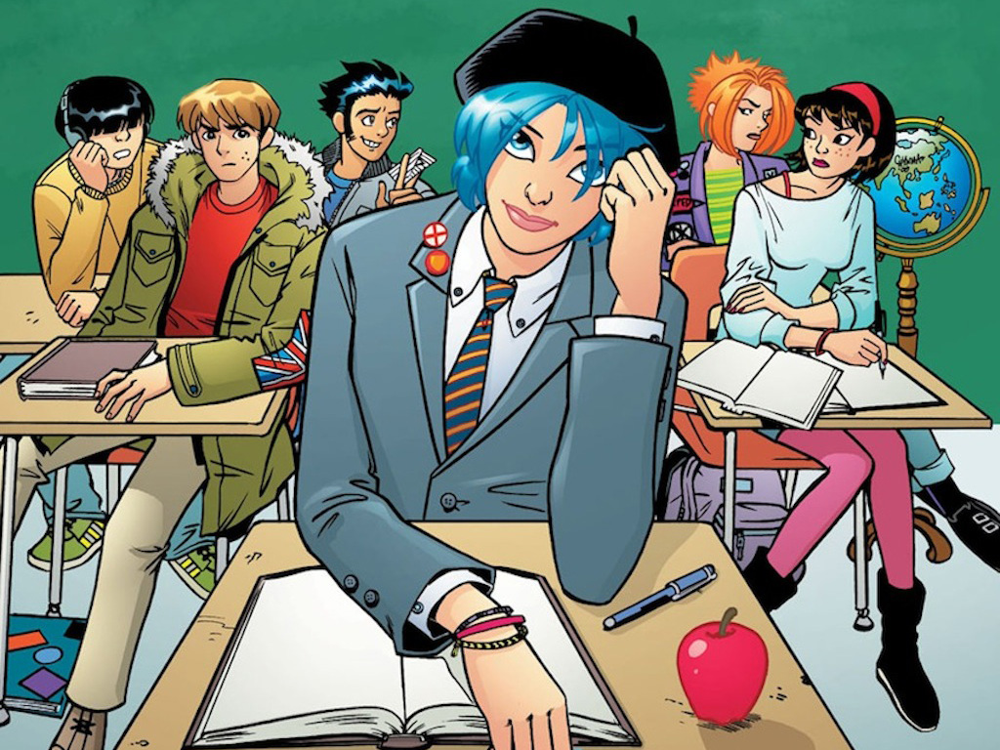
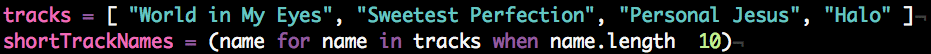
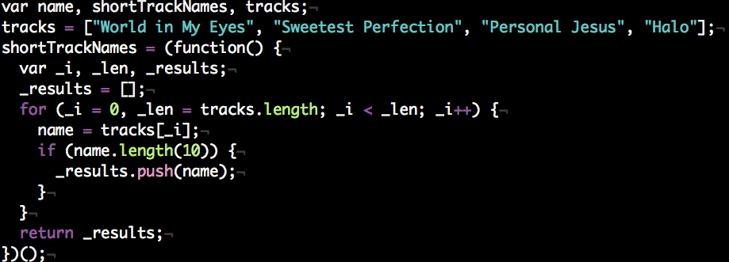

!SLIDE checkers

# CoffeeScript A Go Go
## A sweet introduction to using CoffeeScript, with a side of coffee, and an extra dollop of '80s music trivia foam.

!SLIDE
# Haiiiii!
## I'm Jessica Allen

!SLIDE

!SLIDE

!SLIDE fullscreen middle

# What is CoffeeScript? 
<b>Blue Monday</b> / Thieves Like Us / by Chynna Clugston

!SLIDE 
# CoffeeScript #

## vs.
# JavaScript

!SLIDE
# Part I #
## Parlez-vous CoffeeScript?
# Part II
## Using it on a webpage (+ jQuery)
# Part III
## Using it in Rails 3.1 ##

!SLIDE
# Don't have it installed? 
## That's okay!
## Click the “Try CoffeeScript” tab on
## coffeescript.com

