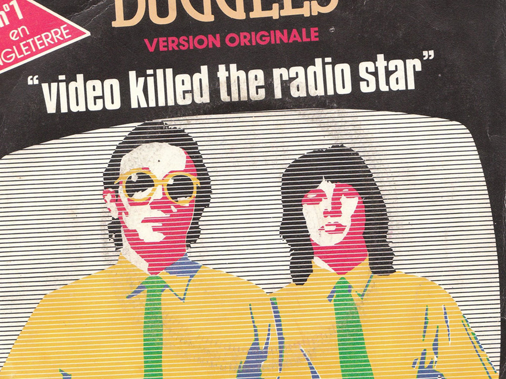
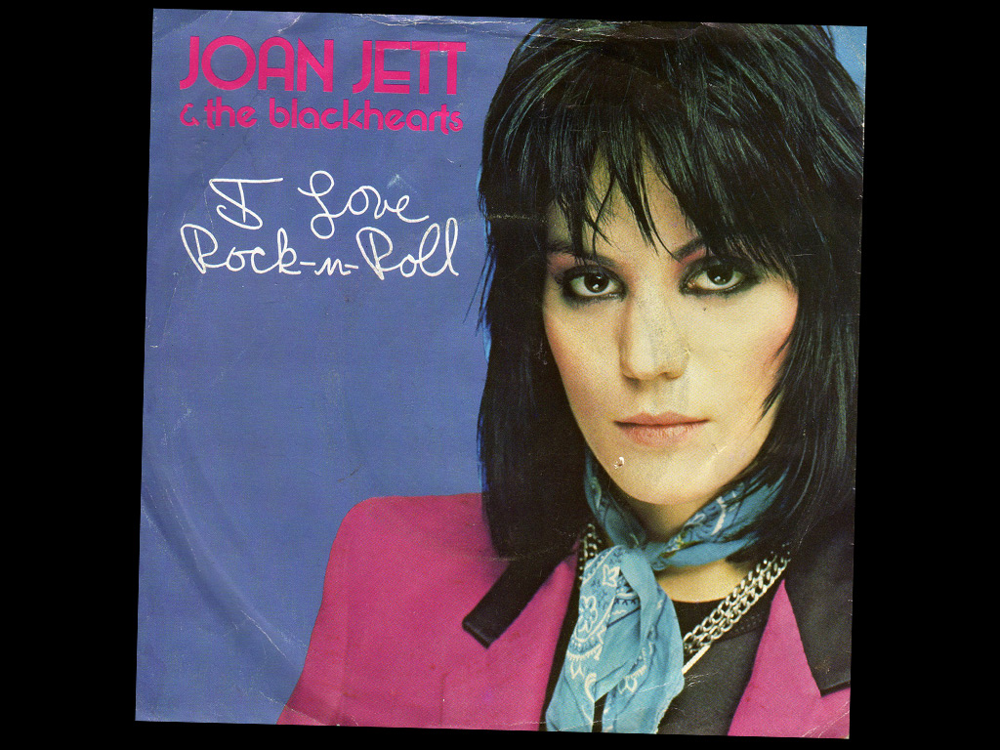
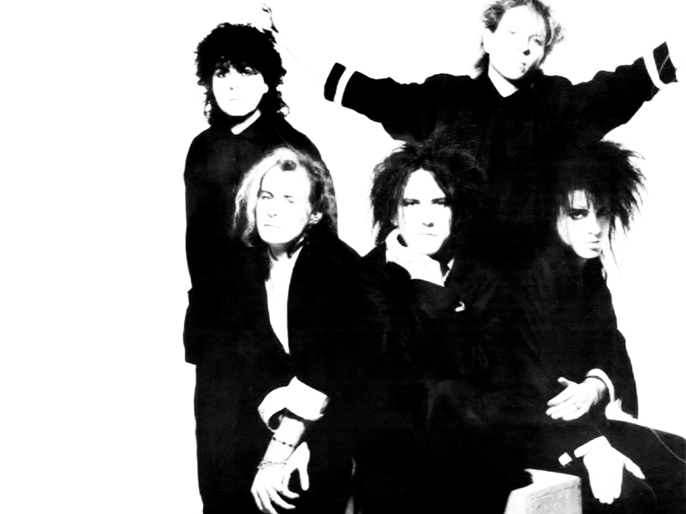
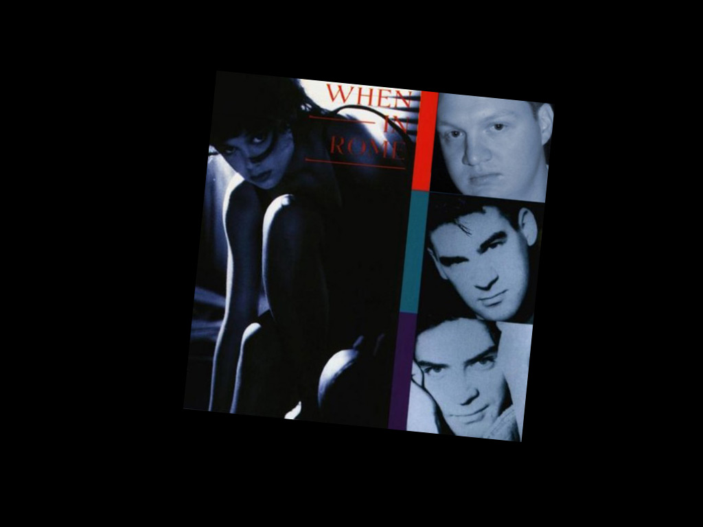
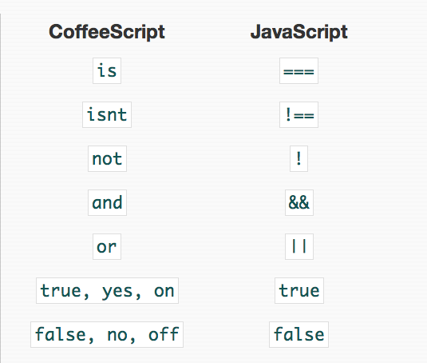

!SLIDE top
# Part I #
## Parlez-vous CoffeeScript?
### Basic syntax

!SLIDE fullscreen

!SLIDE code-sample
## Variables, strings, numbers, interpolation ##
<!-- <a href="" class="minibutton run">Run it.</a>

Results go here.
 -->

<textarea id="string-assignment">
</textarea>

<b>The Buggles</b> / Video Killed The Radio Star

!SLIDE fullscreen

!SLIDE code-sample
## Functions

<textarea id="functions">
</textarea>

  <b>Joan Jett & The Blackhearts</b> / I Love Rock-n-Roll   
  <b>Information Society</b> / Lay All Your Love On Me
 

!SLIDE bottom fullscreen

!SLIDE code-sample
## Objects #

<textarea id="objects">
quiteMoody =
  monday: "feel blue" 
  tuesday: "feel gray"
  wednesday: "feel gray again"
  thursday: "do not care about you"
  friday: "am in love"
</textarea>

    
<b>The Cure</b> / Friday I'm in Love

!SLIDE fullscreen

<!-- !SLIDE
## Logical Operators ##
 -->

!SLIDE code-sample   
## Conditions ##

<textarea id="conditions">
</textarea>

   

<b>When In Rome</b> / The Promise

!SLIDE 
# Want the examples?
## https://gist.github.com/1225971