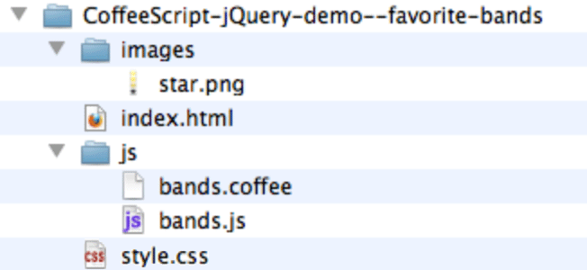
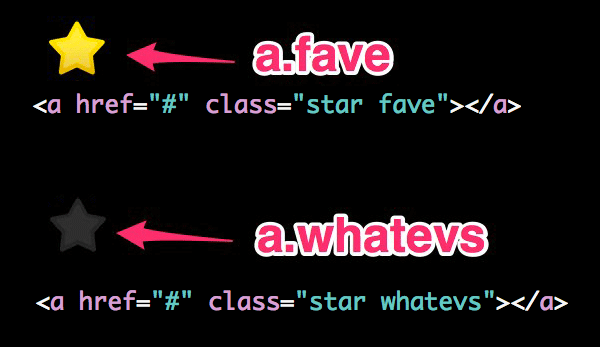

!SLIDE
# Part II
## Standalone website

### Picking Favorite Bands 

!SLIDE
## File tree

### Take a peek if you would like:
### https://github.com/spacekat ###
### CoffeeScript-jQuery-demo--favorite-bands ###

!SLIDE code-sample
## HTML for listing a single band ##
    @@@ html
    <li>
      <h2>OMD</h2>
      
      

    </li>

index.html

!SLIDE code-sample
## HTML for including JavaScript ##
    @@@ html
    <!-- jQuery imported from Google -->
    

    <!-- import your generated JavaScript file -->
    

index.html

  
!SLIDE code-sample
## .star classes ##

style.css

!SLIDE
# jQuery Snack Break #

## http://api.jquery.com/ ##
Adventure Time

!SLIDE code-sample execute incremental coffeescript
## Add .click() and .toggleClass() ##
    @@@ javascript
    $(document).ready ->

      $('a').click (event) ->
        event.preventDefault()
        $(this).toggleClass('fave whatevs')
        
bands.coffee

!SLIDE code-sample
## Watch and compile #
    @@@ Shell
    $ coffee -wc js/
    
!SLIDE bullets incremental
# It works! But... #

* All in the browser, no database.
* If you refresh, your faves are blown away.
* So, lets fix that with Rails.