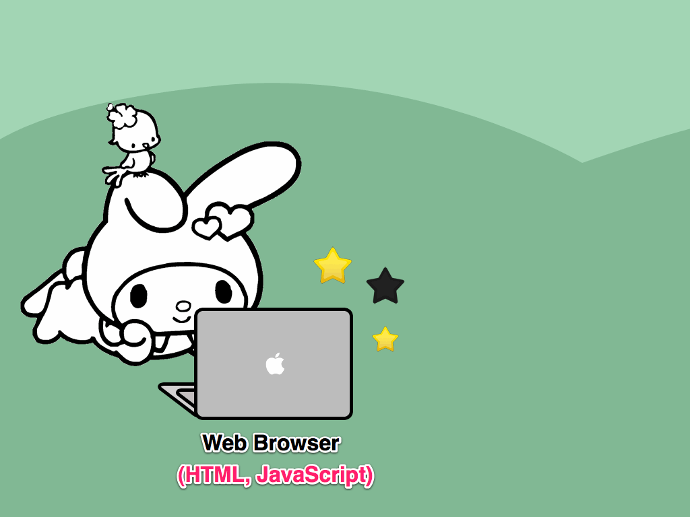
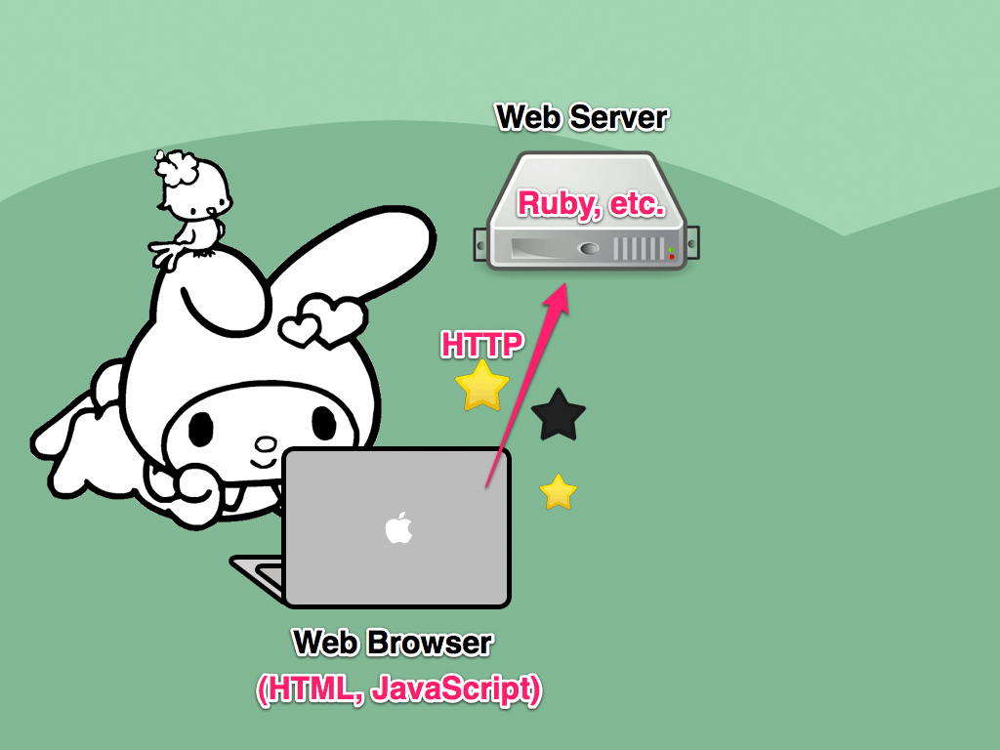
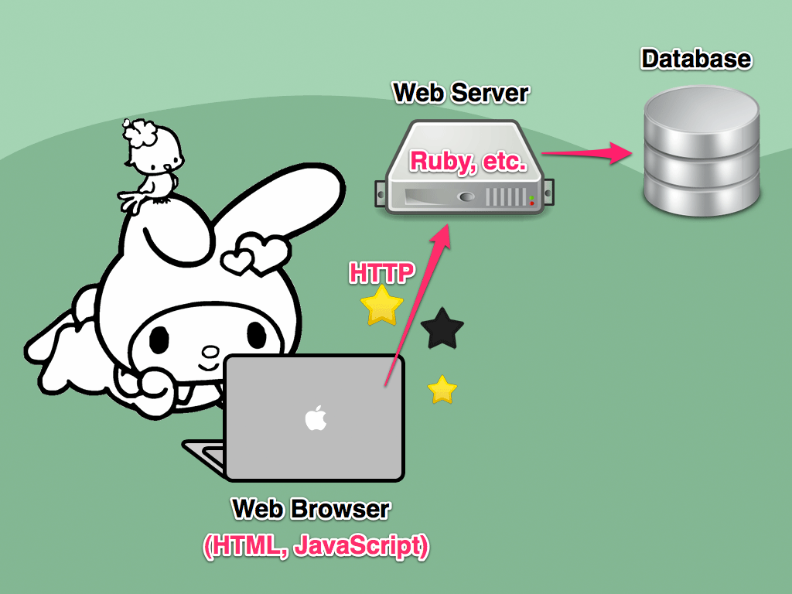
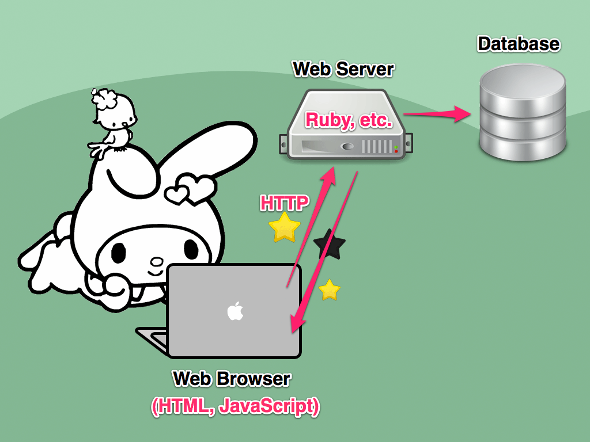

!SLIDE
# Part III
## Enhancing with Rails

### Picking Favorite Bands ###

!SLIDE bullets incremental transition=fade

## Rails 3.1 + CoffeeScript = BFF
* .coffee files in /app/assets/javascripts
* jQuery is included by default

!SLIDE bullets incremental
# Setting up the Rails app #

* Database: New table "Bands" that stores a band name, and a favorite flag.
* Routes: Added route to /favorite
<!-- (config/routes.rb) -->

!SLIDE bullets incremental

* Bands Model: Added the function  "def toggle_favorite"
<!-- (to app/models/band.rb) -->
* Bands View: Dynamically loaded with bands from the database. 
<!-- (in app/views/bands/index.html.erb) -->
* Bands Controller: Added action called "favorite"
<!-- (app/controllers/bands_controller.rb) -->

!SLIDE
# Whew! 
## Okay, lets add an AJAX request

!SLIDE fullscreen

!SLIDE fullscreen

!SLIDE fullscreen

!SLIDE fullscreen

!SLIDE incremental
## Adding the AJAX request #

    @@@ javascript
    $ ->
      $("a").click (e) ->
        selectedLink = ($ this)
        e.preventDefault()
        $.ajax {
          type: "PUT"
          dataType: 'json'
          url: $(this).attr('href')
          success: (res) ->
            selectedLink
              .toggleClass("fave whatevs")
        }
        false  

bands.coffee

!SLIDE
# Hooray!
## Now the favorites are saved to the database ##

!SLIDE bullets incremental
# Even better
## Use Rails' Remote Links
* Powered by the UJS driver, rails.js
* Allow us to override click events with AJAX submissions
* Easy to setup with HTML5 'data-' tags

!SLIDE bullets incremental
# Setup the view to use Remote Links #

* Update the star HREF with data- tags
* data-remote="true"
* data-method="put"

!SLIDE
## Before ##
    @@@ html
    <a href="<%= favorite_band_path(band) %>" 
    class="star favorite-manual 
    <%= band.favorite ? "fave" : "whatevs" %>"></a>
    
## After ##
    @@@ ruby
    <%= link_to "", favorite_band_path(band),
      :remote => true,
      :method => :put,
      :class => "favorite-rails star 
      #{band.favorite ? "fave" : "whatevs"}" %>

/app/views/bands/index.erb

!SLIDE
## Scratch that big ajax() call #
### Instead, bind the event "ajax:success" to the link
    @@@ javascript
    $ ->
      $("a").bind 'ajax:success', ->
        $(this).toggleClass("fave whatevs")

bands.coffee

!SLIDE
# Woot! 
## Now it only uses 3 lines of CoffeeScript.